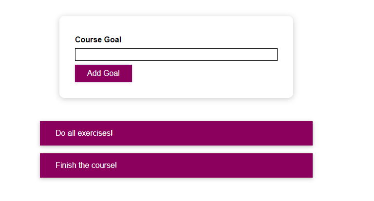
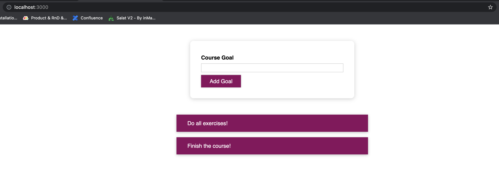
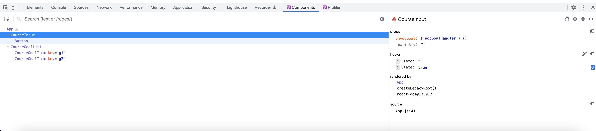
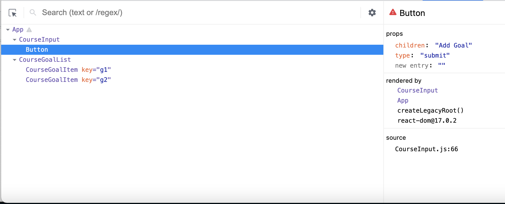

## Styling with React

<ins>Conditional in-element styling</ins>

As explained in [the previous react guide](https://github.com/kshayk/react-basics-one), we can set styling to an element by using the ```style``` attribute. Since the styling is basically a Javascript object, we can utilize this to set a specific styling to an element only if a certain state condition is met.

Let's take for example this project:



Most of the code is already there, nothing that was already mentioned in the previous guide.

What we want to do now is to make sure that if a user is trying to add a goal with the button, if the input is invalid (i.e. empty),
We want the title and the input border to be red.

This is a conditional styling because the styling depends on some variable, in this case a state variable.

This is the component code of the small form:

```javascript
const CourseInput = props => {
  const [enteredValue, setEnteredValue] = useState('');
  const [isValid, setIsValid] = useState(true);

  const goalInputChangeHandler = event => {
    setEnteredValue(event.target.value);
  };

  const formSubmitHandler = event => {
    event.preventDefault();

    if (enteredValue.trim().length === 0) {
      setIsValid(false);
      return;
    }

    setIsValid(true);

    props.onAddGoal(enteredValue);
  };

  return (
    <form onSubmit={formSubmitHandler}>
      <div className="form-control">
        <label>Course Goal</label>
        <input type="text" onChange={goalInputChangeHandler} />
      </div>
      <Button type="submit">Add Goal</Button>
    </form>
  );
};
```

As we can see, we have a state variable called ```isValid``` which indicates whether the inputted text is not empty,
as can be seen from the usage of ```setIsValid``` in the ```formSubmitHandler``` function, when a user submits the form.

Now, using this ```isValid``` value, we want to apply some styling based on whether it is true or false. 
If it's true, then the input border and the title label should be black (default color)
and when the ```isValid``` is false, we want the input border and label to be red, indicating that something is wrong.

To apply such conditioning, we can simply add this ```style``` syntax in the relevant elements:

```javascript
return (
    <form onSubmit={formSubmitHandler}>
      <div className="form-control">
        <label style={{color: !isValid ? 'red' : 'black'}}>Course Goal</label>
        <input type="text" style={{borderColor: !isValid ? 'red' : 'black'}} onChange={goalInputChangeHandler} />
      </div>
      <Button type="submit">Add Goal</Button>
    </form>
);
```

Utilizing the face that the styling is an object, we can do an inline conditioning and return the desired value to be set as the styling.
We can also extract this to an outer variable, so we get a cleaner code:

```javascript
let inputColor = 'black';
if (!isValid) {
    inputColor = 'red';
}

return (
    <form onSubmit={formSubmitHandler}>
      <div className="form-control">
        <label style={{color: inputColor}}>Course Goal</label>
        <input type="text" style={{borderColor: inputColor}} onChange={goalInputChangeHandler} />
      </div>
      <Button type="submit">Add Goal</Button>
    </form>
);
```

Sometimes however, if the ```style``` attribute contains a lot of data, having it set up in the JSX can cause the component to be very large and messy.

Another alternative is to make the element's class dynamic, so the styling will sit under the ```css``` file but will only be set on a certain ```className```. So we set the styling in the ```css``` file:

```css
.form-control.invalid input {
  border-color: red;
  background: #ffd7d7;
}

.form-control.invalid label {
  color: red;
}
```

This will search for a ```div``` with a class of "invalid" and then it will assign the styling to both the input and label, respectively.
Of course this "invalid" class will only be present in the ```div``` if the ```isValid``` state variable is false.

To make sure that the ```div``` class is invalid when the ```isValid``` state variable is false, we can do the following class conditioning syntax:

```javascript
return (
    <form onSubmit={formSubmitHandler}>
      <div className={`form-control ${!isValid && 'invalid'}`}>
        <label>Course Goal</label>
        <input type="text" onChange={goalInputChangeHandler} />
      </div>
      <Button type="submit">Add Goal</Button>
    </form>
);
```

Instead of using regular ```"form-control"``` syntax in the ```className```, we make it dynamic by using the ```{}``` and then we
assign the "invalid" class as well only if the ```isValid``` state variable is false.

This way the code is much cleaner and easier to read. Of course, we can also set the class name in a variable outside the return statement and then set it in the ```className``,
which will result in even cleaner code.

We can add as many dynamic class inside the ```className``` as we want, each one with its own ```${}``` syntax.

##
<ins>Styled components and CSS scope</ins>

Although what we might think, when a component is importing a ```css``` file, 
the scope of that ```css``` file will act as the scope of the entire project and not just affect the component itself, but all the other components.
So if in one component you have a div that's connected to some styling in a ```css``` file,
and a different component has the same div, the second component will still get the styling although the ```css``` file
is not even connected to this component.

This is because when importing a ```css``` file, the styling is set on the HTML page, and as we know,
once there is a styling connected to a page, each element that corresponds with the styling pointers, will be applied those stylings.

While taking this understanding into consideration, we can be careful to not name element classes and ids with the same name if we expect different styles for them.

We can also make sure the styles are only scope to the specific component by using an npm package called ["styled components"](https://styled-components.com/).
We can install this package by running:

```bash
npm install styled-components
```

After the installation, we will take the Button component for the example:

```javascript
import React from 'react';

import './Button.module.css';

const Button = props => {
  return (
    <button type={props.type} className="button" onClick={props.onClick}>
      {props.children}
    </button>
  );
};

export default Button;
```

Currently, this component renders a button and imports a ```css``` file corresponding with the button class.
We want this component to have some styling that will only affect this component, so to do that, this is the syntax
we would need to use, by using the "styled components" package:

```javascript
import styled from 'styled-components'

const Button = styled.button`
  font: inherit;
  padding: 0.5rem 1.5rem;
  border: 1px solid #8b005d;
  color: white;
  background: #8b005d;
  box-shadow: 0 0 4px rgba(0, 0, 0, 0.26);
  cursor: pointer;
  
  &:focus {
    outline: none;
  }

  &:hover,
  &:active {
    background: #ac0e77;
    border-color: #ac0e77;
    box-shadow: 0 0 8px rgba(0, 0, 0, 0.26);
  }
`;

export default Button;
```

First we must import the ```styled-components``` module. Then, to build the component itself, 
we first understand how the styled-components work.

Basically, the ```styled-components``` module which is represented by the ```styled``` const in our case,
is a module that contains static functions. 

Those functions eventually return an HTML element corresponding with the function name.
Those functions require a special kind of parameter. This parameter is not sent in the function call, but rather getting defined in the back-ticks after the function call, like this:  styled.button\``.
This syntax is not unique to React or ```styled-components``` but actually a valid JS syntax and is called "Tagged Template Literals". 
In short, this allows calling a function a dynamic text, which then the function splits the text into segments where the text is hard-coded and where it's dynamic (a variable represented by ```${}``` in the back tick syntax).
The details are irrelevant here since ```styled-components``` already handles this, but you can find more info about "tagged template literals" [here](https://wesbos.com/tagged-template-literals).

Inside the template literals (the back ticks) we defined our ```css``` code similar to what we would define in the actual ```css``` fine.
The main difference between the two syntaxes is we do not have to declare what element or class the styling should be set for with ```styled-components```, 
since the fact that we use the ```button``` function indicates that we're only having this one element, the ```<button>``` element.

The differences between both syntaxes can be shown below, where the ```Button.css``` file would have this syntax:

```css
.button {
  font: inherit;
  padding: 0.5rem 1.5rem;
  border: 1px solid #8b005d;
  color: white;
  background: #8b005d;
  box-shadow: 0 0 4px rgba(0, 0, 0, 0.26);
  cursor: pointer;
}

.button:focus {
  outline: none;
}

.button:hover,
.button:active {
  background: #ac0e77;
  border-color: #ac0e77;
  box-shadow: 0 0 8px rgba(0, 0, 0, 0.26);
}
```

But the ```styled-components``` syntax will look like this:

```css
font: inherit;
padding: 0.5rem 1.5rem;
border: 1px solid #8b005d;
color: white;
background: #8b005d;
box-shadow: 0 0 4px rgba(0, 0, 0, 0.26);
cursor: pointer;

&:focus {
outline: none;
}

&:hover,
&:active {
background: #ac0e77;
border-color: #ac0e77;
box-shadow: 0 0 8px rgba(0, 0, 0, 0.26);
}
```

We can see how we declare some styles without applying them to a specific element.
This syntax would fail if we put it in any ```css``` file, but ```styled-components``` will take this long style string (the whole ```css``` code is still just a string passed to the ```button``` function via tagged template literals)
and will set it correctly into the ```<button>``` element.

We can also see that instead of declaring ```button:focus``` or ```button:hover```, we simply write ```&:focus``` and ```&:hover```.
This is because of the same reason we do not have to declare the styling on an element. 
```styled-components``` already know which element we are talking about, so using the ```&``` syntax simply says that we want those additional styling when the hover and focus happen on that ```<button>``` element that was created by the ```styled-components```.

We can do the same for the form control div, and create a styled component instead of using the ```CourseInout.css``` file.

We will first create the styled component as we did with the button, but since this will only be used inside the ```CourseInput.js```
file, we can create the styled component inside that file, instead of creating a new file for the styled component like we did
with the button. That's because the button will most likely be used in other components while the form control component will
only be used once in the application:

```javascript
// Creating a styled component inside the same CourseInput.js component, because it's a child component that will only be rendered inside the CourseInput component
const FormControl = styled.div`
  margin: 0.5rem 0;

  & label {
    font-weight: bold;
    display: block;
    margin-bottom: 0.5rem;
  }

  & input {
    display: block;
    width: 100%;
    border: 1px solid #ccc;
    font: inherit;
    line-height: 1.5rem;
    padding: 0 0.25rem;
  }

  & input:focus {
    outline: none;
    background: #fad0ec;
    border-color: #8b005d;
  }

  &.invalid input {
    border-color: red;
    background: #ffd7d7;
  }

  &.invalid label {
    color: red;
  }
`;
```

And then simply use it instead of the div:

```javascript
<form onSubmit={formSubmitHandler}>
    <FormControl>
        <label>Course Goal</label>
        <input type="text" onChange={goalInputChangeHandler}/>
    </FormControl>
    <Button type="submit">Add Goal</Button>
</form>
```

But if you look back on that div we replaced:

```javascript
<div className={`form-control ${!isValid && 'invalid'}`}>
    <label>Course Goal</label>
    <input type="text" onChange={goalInputChangeHandler} />
</div>
```

You can see that when using the styled components we face an issue; When we submitted an invalid form in the UI, we would have
gotten a red lining for that input, indicating that the input was invalid. This was done because we dynamically assigned a
```className``` with and "invalid" value whenever a submit to that form included an invalid data.

One way that styled components offer is to assign a ```className``` to that component, the same way we do it in a regular component.
So we can simply add the valid condition to that component's class. Also since this is a styled component,
we no longer need to specify that the class name is "form-control" since the styled components will assign the styles as
a default to that component:

```javascript
<FormControl className={!isValid && "invalid"}>
    <label>Course Goal</label>
    <input type="text" onChange={goalInputChangeHandler}/>
</FormControl>
```

But another way that we can utilize conditional styles in styled components is to pass in a boolean value as a custom prop
and then use that prop to conditionally assign a style inside the template literals:

```javascript
<FormControl invalid={!isValid}>
```

And now, instead of assigning some style to a specific class, we can simply condition our styles. For example, we want the
input border to be red when the data is invalid. So instead of using this syntax in the styled component:

```css
&.invalid input {
    border-color: red;
    background: #ffd7d7;
}
```

We can simply utilize the fact that we now have the ```invalid``` prop and just assign the correct border color based on 
the value of the ```invalid``` prop:

```css
& input {
    display: block;
    width: 100%;
    border: 1px solid ${props => props.invalid ? 'red' : '#ccc'};
    background: ${props => props.invalid ? '#ffd7d7' : 'transparent'};
    font: inherit;
    line-height: 1.5rem;
    padding: 0 0.25rem;
}
```

Since this is a template literal, we can use JS syntax inside the ```${}```. To use the ```invalid``` prop, we will need 
the JS syntax to be a function that gets the props (the ones that we assign to the ```FormControl``` component) as a parameter
and then will return the desired value based on that parameter. In this case we check if ```props.invalid``` is true, 
meaning that the form input was invalid, we return "red" as the value for the border. Else, we return the default color which
is ```#ccc```. Same logic goes to the background color.

Since the label is also styled according to the validity of the input value, we will also do the same logic for the label style:

```css
& label {
    font-weight: bold;
    display: block;
    margin-bottom: 0.5rem;
    color: ${props => props.invalid ? 'red' : 'black'};
}
```

We can also use the ```@media``` query inside the styled components. Like so:

```css
const Button = styled.button`
  width: 100%;
  @media (min-width: 768px) {
    width: auto;
  }
  .
  .
  .
`
```

In this case we applied it to the button styled component. What this syntax means is basically saying that the width of the button
should be 100%, except if the minimum width of the current media that is viewing this website is more than 768 pixels, which
In this case, the width of the button should be "auto". So basically, on phone devices the button should take the whole width
of the container, while on a computer it will only use the needed space for it to show the inner text in the button.


##
<ins>CSS Modules</ins>

While the styled components provide a solid way of applying CSS styles to a specific component. CSS modules is another way
of making sure that we avoid class name clashing. Class name clashing simply means that since all CSS files will be loaded
in the root scope, having a lot of components can result in some elements to include the same className. This can cause the
desired styling for an element to get overridden by a different CSS file that targets the same class name.

CSS modules is not a React ability, but react allows us to use this out of the box while outside React we will need to 
configure some additional stuff in order to make it work.

So how do we use CSS modules? First, we need to create a CSS file like we usually do, but when we name that file, we need to
make sure to add ```.module``` to the name of that file before the ```.css``` extension. So for example, if we have the 
```Button.css``` file we created earlier, we will need to rename it as ```Button.module.css```.

The next thing we need to do is to import the CSS file in the component. The difference between importing a regular CSS file
and a CSS module file, is that with CSS modules, we import the file as we import any other module.

Let's take the ```Button``` component for example and assume with use the CSS module approach instead of the styled components
approach. First we will import the CSS file:

```javascript
import styles from './Button.module.css';
```

Usually when we import a CSS module, we will use ```styles``` or ```classes``` as the alias.

Next, we will apply the class name for the ```<button>``` element with the following syntax:

```javascript
<button type={type} className={styles.button} onClick={onClick}>
    {children}
</button>
```

What happens here is that since the CSS file has a ```.button {}``` reference, when we import the CSS module, it will include
a ```button``` property that holds a unique class name as the value. So by assigning
```styles.button``` as the className, it will make sure to apply all the CSS that is related to the ```button``` class onto
that ```<button>``` element.

Behind the scenes, the CSS module will generate a unique name for the element's class that will also exist in the CSS module
file that was imported. The reason is to avoid having two CSS files with the same class selector clash with one another, 
so by using CSS module it will ensure that each CSS file will have unique selectors.

We can make sure it works by inspecting the element in the browser and see what class name it provided for that element. 
Here is what is showing in my browser after applying a CSS module on my ```<button>``` element:

```html
<button type="submit" class="Button_button__3NBJX">Add Goal</button>
```

We can also go with the same approach of CSS modules in the ```CourseInput.js``` where we have a styled "form-control" div
which earlier transformed into a styled component.
So once again, we will need to rename ```CourseInput.css``` to ```CourseInput.module.css```. We then change the ```FormControl``` 
styled component into a regular div, so we can then apply the className based on the CSS module class.

If you remember earlier, we did the same thing with the ```Button.js``` component. With the button element we changed it 
back to regular HTML ```<buttom>``` element, and we applied the class name from the CSS module:

```javascript
<button type={type} className={styles.button} onClick={onClick}>
```

Since the class selector in the ```Button.module.css``` file was simply "button" we used ```styles.button``` in order to 
reference that class name.

But with ```CourseInput.module.css``` we have a problem; the class selector in this file is ```.form-control``` and if we
try to do ```<div className={styles.form-control}>``` we get an error because ```form-control``` is not a valid object property
in JavaScript.

Fortunately, we can also access object's properties with square brackets, like an array index. So in ```CourseInput``` case,
we will use the following syntax:

```javascript
return (
    <form onSubmit={formSubmitHandler}>
        <div className={styles['form-control']}>
            <label>Course Goal</label>
            <input type="text" onChange={goalInputChangeHandler}/>
        </div>
        <Button type="submit">Add Goal</Button>
    </form>
);
```

And of course, first we will also need to import the CSS module file in the same way we did it in the ```Button``` component:

```javascript
import styles from './CourseInput.module.css';
```

As opposed to the ```Button``` component, in the ```CourseInput``` component we should have a conditional class name of
"invalid" whenever the form input value is invalid, so we can add some red styling to the form, indicating that the form is invalid.


Currently, this "invalid" logic does not work by only applying the ```styles['form-control']``` className, we should also 
need to add the conditional "invalid" class whenever the ```isValid``` state is false. To do that we use the previously covered
way of adding a conditional class names by using template literals in the className prop:

```javascript
<div className={`${styles['form-control']} ${!isValid && styles.invalid}`}>
```

That way we concatenate both the "form-control" class name and the "invalid" class name. You can see that the "invalid" 
class name is also generated from the CSS module class as a property, and as a result we use ```styles.invalid``` to apply
the class name into the div.

As previously mentioned in the styled components section, we added a ```@media``` query to the styled component string.
But since now we use the CSS modules, we simply use the ```@media``` query in the ```Button.module.css``` file normally, 
making sure that inside that ```@media``` query we specify the class we want to change:

```css
@media (min-width: 768px) {
  .button {
    width: auto;
  }
}
```

Since we wanted the button to have a width of 100% whenever the media is below 768 pixels, we should specify it under the
```.button``` main style:

```css
.button {
  width: 100%;
  font: inherit;
  padding: 0.5rem 1.5rem;
  border: 1px solid #8b005d;
  color: white;
  background: #8b005d;
  box-shadow: 0 0 4px rgba(0, 0, 0, 0.26);
  cursor: pointer;
}
```


##
<ins>Debugging the React Project</ins>

### Error Messages

While working on your React app you might encounter some compiling errors. Those errors will appear whenever you build your
app. for example when running ```npm run start```.

A lot of times, React will tell us exactly what the error is, and even when it occurs in the code. This allows us to easily
detect the problem and fix it in the correct location.

For example, in our ```App.js``` component, we have this return statement:

```javascript
return (
    <div>
      <section id="goal-form">
        <CourseInput onAddGoal={addGoalHandler} />
      </section>
      <section id="goals">
        {content}
      </section>
    </div>
);
```

The two ```<section>``` elements are wrapped with a ```<div>``` element. As we know, a return statement of a React component
must have only one wrapper element. So if we remove the ```<div>``` element, we are left with this code:

```javascript
return (
      <section id="goal-form">
        <CourseInput onAddGoal={addGoalHandler} />
      </section>
      <section id="goals">
        {content}
      </section>
  );
```

This is an invalid code by React standards, and it will result in a compilation failure. So when we run ```npm run start```
 we will be prompted with the following error in the terminal window:

```bash
Failed to compile.

./src/App.js
SyntaxError: /Users/shayk/dev/projects/react-basics-two/src/App.js: Adjacent JSX elements must be wrapped in an enclosing tag. Did you want a JSX fragment <>...</>? (42:6)

  40 |         <CourseInput onAddGoal={addGoalHandler} />
  41 |       </section>
> 42 |       <section id="goals">
     |       ^
  43 |         {content}
  44 |       </section>
  45 |   );
```

As we can see, it tells us exactly what the problem is and also what file and line of code it occurs in: 
```SyntaxError: /Users/shayk/dev/projects/react-basics-two/src/App.js: Adjacent JSX elements must be wrapped in an enclosing tag. Did you want a JSX fragment <>...</>? (42:6)```

If we go to the browser and try to run the application in ```localhost:3000```, we might see a blank page, but if we go to 
the console in the developer tools (by clicking ```F12``` in the Chrome browser), we should see the same error:

```bash
index.js:1 src/App.js
  Line 42:7:  Parsing error: Adjacent JSX elements must be wrapped in an enclosing tag. Did you want a JSX fragment <>...</>?

  40 |         <CourseInput onAddGoal={addGoalHandler} />
  41 |       </section>
> 42 |       <section id="goals">
     |       ^
  43 |         {content}
  44 |       </section>
  45 |   );
```

React makes it easy on us to understand the errors we get in the application, and usually it will be pretty easy to find and
fix those errors.


### Warning Messages

Sometimes a compilation will execute with no errors, but we might get run-time errors when using the application in the 
browser. For example, as we know, when creating elements through iterations in React, we must add a ```key``` prop with a 
unique value to each of the elements. If we do not do that, although React strongly recommends doing so, we will not get any
compilation errors when building the application. Instead, when running the app in the browser, we will get some warnings 
in the console which indicate that there is no ```key``` property to those elements.

For example, we have this code in ```CourseGoualList.js```:

```javascript
const CourseGoalList = props => {
  return (
    <ul className="goal-list">
      {props.items.map(goal => (
        <CourseGoalItem
          key={goal.id}
          id={goal.id}
          onDelete={props.onDeleteItem}
        >
          {goal.text}
        </CourseGoalItem>
      ))}
    </ul>
  );
};
```

We iterate through the goals with ```map```. Each goal will render a new ```<CourseGoalItem>``` component with some props,
including a ```key``` prop which is essential for iterated items.

If we then remove the ```key``` prop from the components:

```javascript
const CourseGoalList = props => {
  return (
    <ul className="goal-list">
      {props.items.map(goal => (
        <CourseGoalItem
          id={goal.id}
          onDelete={props.onDeleteItem}
        >
          {goal.text}
        </CourseGoalItem>
      ))}
    </ul>
  );
};
```

It will compile the project as usual, but when we run the application in the browser we will see the following warning:

```bash
index.js:1 Warning: Each child in a list should have a unique "key" prop.

Check the render method of `CourseGoalList`. See https://reactjs.org/link/warning-keys for more information.
    at CourseGoalItem (http://localhost:3000/static/js/main.chunk.js:554:21)
    at CourseGoalList (http://localhost:3000/main.be7cddc59bcc2b3b2c9a.hot-update.js:31:21)
    at section
    at div
    at App (http://localhost:3000/static/js/main.chunk.js:266:95)
```

Those warnings should not be ignored and you most likely will need to fix them. That's why it is generally a good idea to
have the console opened in your browser when you are testing your React code. 


### React Developer Tools

The Chrome browser offers an option to add an extension called "React Developer Tools". This extension allows us to view
all the components of the current the UI in the developer tools of the browser (by clicking ```F12```),
showing their hierarchy, states and values.

For example, if we visit the main page of our current project:


By clicking the ```F12``` button and accessing the developer tools, we can see that we now have an option called "Components"
with a React logo:



When accessing this, we are seeing the component tree of the current UI on the left. So we can see that on the top of that
tree there is the ```App``` component, and below the ```App``` components we have the ```CourseInput``` and the ```CourseGoalList```
as the child components.

In this current example we clicked on the ```CourseInput``` component as it is highlighted in blue in the developer tools.
When clicking on a component in this component tree, all the info regarding the component is shown on the right side of the
developer tools.

On this panel we have several sections. Let's try to break down those sections one by one:

#### 1. props

The ```props``` section indicates which props are passed on to this component. In this case the only prop that is sent to
the ```CourseInput``` component is a function called ```addGoalHandler```.

#### 2. hooks

The ```hooks``` section indicates all the hooks that are in use in this component. It doesn't specify the variable name 
of each hook, but it will show the current value of the hook. In this example we have 2 hooks in the ```CourseInput``` component.
The first hook is the text input state hook value while the second hook is the ```isValid``` state hook which is currently true.
We can see those hooks in the component code:

```javascript
const [enteredValue, setEnteredValue] = useState('');
const [isValid, setIsValid] = useState(true);
```

You should know that you are able to change the hooks values (especially the state ones) inside the React developer tools
in order to check the functionality of the component without needing to reach the certain state by performing actual actions
on the UI. You can simple select the desired state hook in the left panel and change its value.

#### 3. rendered by

The ```rendered by``` section is the hierarchy of the creation of the selected component. It means that it will list all
the parent components of the selected component. In this case, the CourseInput component is rendered as a children component
of the ```App``` component. We can also see this in the left panel where the whole component tree is shown.

If we selected the ```Button``` component instead, the ```rendered by``` section would have looked like that:



That's because the ```Button``` component is rendered by the ```CourseInput``` component which is rendered by the ```App```
component.

Note that in the ```rendered by``` section, the top most component is the immediate parent of the selected component, and
the one below it is the component that rendered the parent component and so on...

#### 4. source

The ```source``` section shows where in the code did the selected component was created, including the file name and the
line of code.